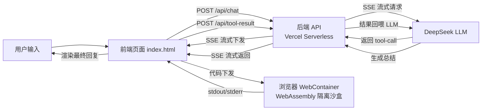

# WebContainer MCP Sandbox Agent

一个运行在浏览器沙盒中的 AI Agent，通过 DeepSeek 大模型调用 MCP 工具，在浏览器端 WebContainer 隔离环境中执行代码，形成完整的多步工具调用闭环。

## 🎯 项目亮点

- **零后端算力**：代码执行完全在用户浏览器的 WebContainer 里完成，后端只负责 LLM 代理和流式传输。
- **浏览器沙盒隔离**：每个用户的执行环境天然隔离，互不干扰。
- **Agent 多步工具调用**：`用户输入 → LLM 调工具 → 浏览器沙盒执行 → 结果回传 → LLM 总结` 完整闭环。
- **执行链路可视化**：右侧 Trace 面板实时展示 Agent 的思考过程、工具调用、沙盒执行日志。

## 🏛 系统架构



**核心链路**：
用户输入 → LLM 意图识别 → 调用 run_python 工具 → 代码下发至浏览器沙盒 → WebContainer 执行 → 结果回传后端 → LLM 生成总结 → 前端渲染最终回复

## 🛠️ 技术栈

| 层 | 技术 |
|---|---|
| 前端 | 原生 HTML/CSS/JS + ESM |
| 沙盒 | @webcontainer/api |
| 后端 | Vercel Serverless Functions（本地调试用 Express） |
| LLM | DeepSeek Chat Completions API |
| 工具调用 | 手动实现 OpenAI 兼容的 tool_calls 协议 |
| 通信 | SSE（Server-Sent Events）流式传输 |
| 部署 | GitHub + Vercel 自动部署 |

## 🚀 快速开始

### 1. 安装依赖

```bash
npm install express cors dotenv
